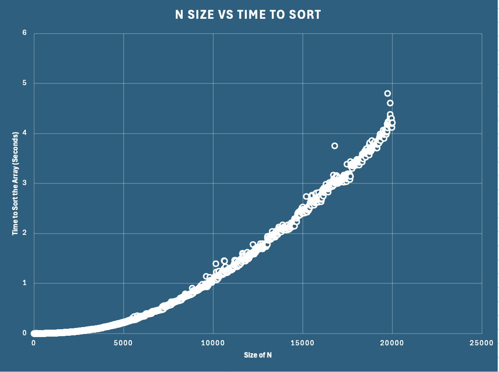

# BubbleSort
This project demonstrates the use of a bubble sort algorithm to sort a dataset of chess games based on their average player ratings. The execution time for sorting different sizes of datasets is measured and recorded. Results of the sorting operation, along with timing data, are written to respective files for later analysis.

### How It Works

1. Main Function:
	- Prompts the user for the number of times they would like to run the sorting operation. 
    - Reads chess games from chess_games.csv, where each game consists of details such as game ID, win status, number of moves, players, and their ratings.
	- Sorts the games using a bubble sort algorithm by their average player rating, and times how long this method takes.
	- Writes the sorted results to a file and appends the execution time to TimeToRun.txt.
2.  Methods:
	- createArrayList(): Creates an ArrayList of ChessGame objects by reading from chess_games.csv.
	- sort(): Sorts chess games by average player rating.
	- swap(): Swaps two chess games within the ArrayList given.
	- printToFile(): Writes the sorted chess games to a file.
	- getChessGame(): Creates a ChessGame object from a given line.

## Below I have pasted the chart of points that I created through Excel.
As you can see, the points seem to follow an increasing slope which means that the function appears to be parabolic.
We can observe the asymptotic analysis of the Big O of the sort method to be O(N2).
Considering the shape of the plot below, we can assume that O(N2) follows a similar path to that of the function below.
We observe that the points at N = 10,000 took fourfold the time of the points at N = 5,000.
We can also observe through the points that as the value of N gets bigger, the variance of time increases.
However, the points still follow a general  parabolic path.
In summary, the actual runtime results are consistent with the theoretical expectations provided by Big O analysis.
The sorting algorithm exhibits O(N2) behavior, where the execution time grows rapidly as the input size increases.

